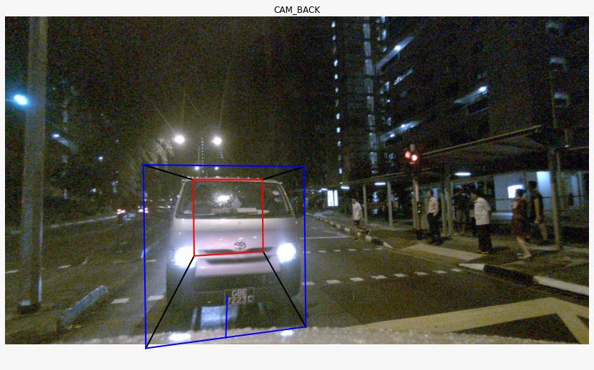
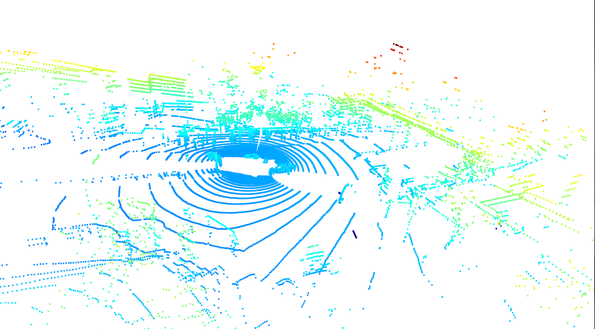
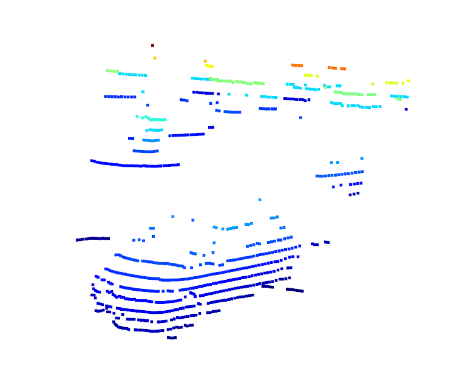
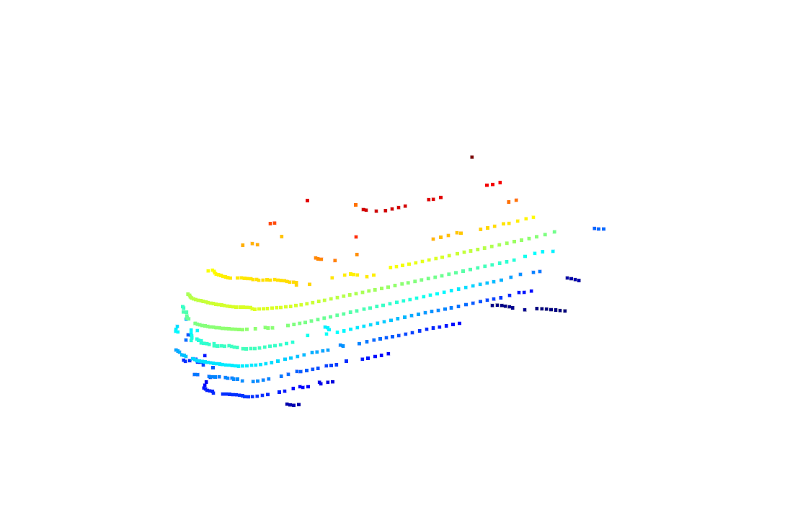
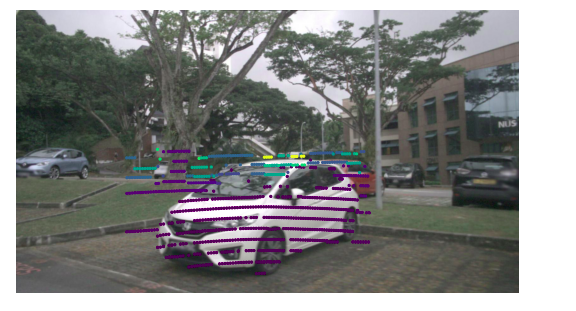
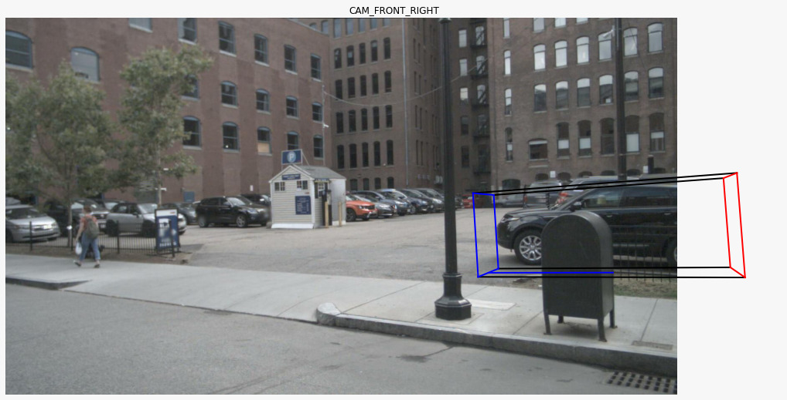


# 3D Object detection using classic Machine Learning

This repository aims to be an end-to-end pipeline for 3D object detection using classic Machine Learning (ML) technique. The idea is to prove that classic ML is capable to tackle complex tasks such as 3D object detection for self-driving vehicles' applications.

<div  align="center">

</div>

## Description

3D object detection is a problem that has earned popularity over the last years as it provides the pose of an interest object with respect to another one e.g. ego-vehicle. This technique has a wide range of applications such as self-driving vehicles, pick-and-place for robotic arms or even surveillance. However, to deploy this systems in real-world applications, real-time inference and accurate results are mandatory.

<div  align="center">

</div>

To address the fist issue we intend to provide an end-to-end 3D object detection pipeline based on classic machine learning techniques. This work is proposed over the novel [NuScenes](https://www.nuscenes.org/) dataset and is leveraged on the idea of frustum region proposal idea presented in [Frustum PointNets for 3D Object Detection from RGB-D Data](https://arxiv.org/abs/1711.08488). Our work deals with the next problems.

 - Floor segmentation
 - Instance segmentation
 - Global feature description from a segmented instance
 - Amodal 3D bounding box parameters estimation

We do not deal with 2D object detection for the frustum region proposal as most of the time, this problem is considered solved using Convolutional Neural Networks (CNN).

## Installation & configuration

To start using this repo,  run the following command and install the needed dependencies.
```
pip install -r requirements.txt
```
Aditionally, you will also need to organize the workspace as shown below and create the folder *build* which is were the C++ file is compiles. We use the Mini NuScenes dataset and this can be found [here](https://www.nuscenes.org/download).

├── `3D Bounding box regressor.ipynb`
├── `Dataset creator.ipynb`
├── `Instance segmentation.ipynb`
├── assets
├── CMakeLists.txt
├── build
├── dataset
│   ├── 3d_obj_detection.csv
│   ├── ann_points_cam 
│   ├── ann_points_lidar 
│   ├── pcd_segmentation 
│   ├── point_features 
│   └── samples 
│ 
├── requirements.txt
├── src
│   └── `pcl_features.cpp`
├── tutorials
│   └── `3d_to_2d_test_methods.ipynb`
└── utils
│   ├── `__init__.py`
│   ├── `misc.py`
│   └── `vis.py`
└──  README.md

## Usage

### Dataset creation

There are four main files in this project:

 1. `Dataset creator.ipynb`
 2.  `Instance segmentation.ipynb`
 3.  `pcl_features.cpp`
 4.  `3D Bounding box regressor.ipynb`

The first file is `Dataset creator.ipynb` and this is used to create the frustum region proposals out of a 2D bounding box. This is accomplished by mapping the LiDAR point cloud to the image frame, filtering the road plane and cropping the points outside the interest bounding box. Additionally, each frustum obtained will have a 3D target which will be used used for prediction. This file saves the metadata of each frustum, the point cloud and another useful information.

<div  align="center">

</div>

For the instance segmentation part, `Instance segmentation.ipynb`segments the car instance out of a given frustum proposal. This is accomplished by the DBSCAN algorithm implementation provided by sklearn. The segmented cars are stored in a different folder for further extraction of the point cloud descriptors.

<div  align="center">

</div>

Here `pcl_features.cpp` is used to extract the global features of the segmented point clouds through  the [Ensemble of Shape Functions (ESF)](https://ieeexplore.ieee.org/document/6181760). To run this file the following steps must be followed.

    mkdir build
    cd build
    cmake ..
    make
    ./pcl_features

This will create the global descriptor for each segmented vehicle.

<div  align="center">

</div>

### Predicting 3D bounding boxes

Finally, `3D Bounding box regressor.ipynb`condense all this information in a CSV file with all the features and targets. There a supervised learning strategy is used to estimate the 3D bounding box parameters. Some of the results obtained are shown below.

<div  align="center">
   
</div>
